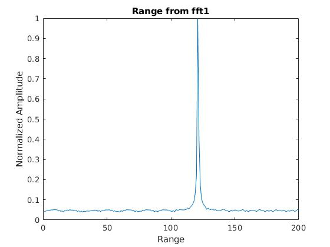
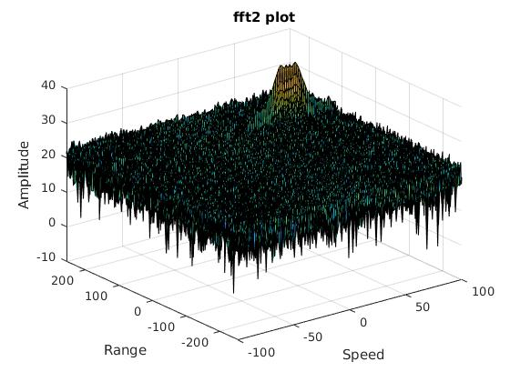
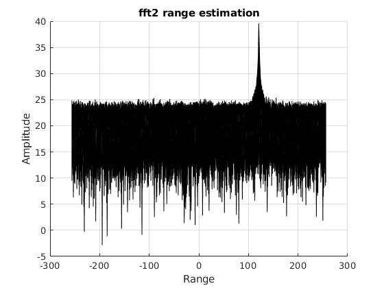
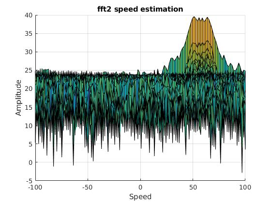
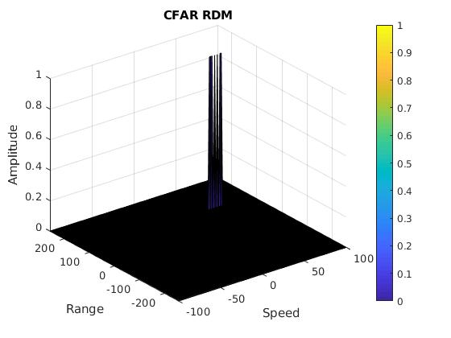
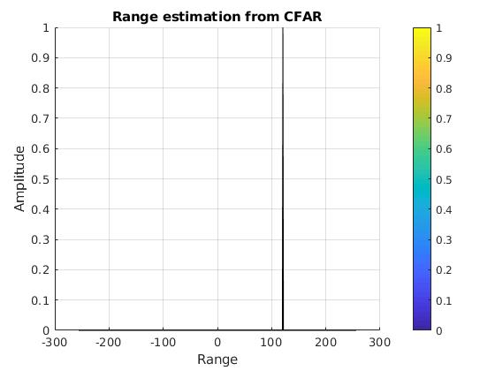
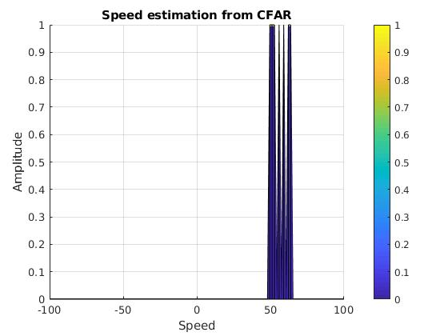

## Implementation steps for the 2D CFAR process
Check what is [CFAR](https://en.wikipedia.org/wiki/Constant_false_alarm_rate) here.

1. Select the number of Training Cells in both the dimensions Tr and Td; and select the number of Guard Cells in both dimensions around the Cell under test(CUT) Gr and Gd. 

2. Design a loop such that it slides the CUT across range doppler map.

3. For every iteration sum the signal level within all the training cells. To sum convert the value from logarithmic to linear using db2pow function.

4. Average the summed values for all of the training cells used. After averaging convert it back to logarithimic using pow2db.

5. Further adding the offset to it to determine the threshold. 

6. Compare the signal under CUT with this threshold. If the CUT level > threshold assign it a value of 1, else equate it to 0.

7. To keep the map size as it was before CFAR, assign 0 to all the non-thresholded cell to 0.


## Selection of Training, Guard cells and offset
The selection or choice of training cells depends on the environment. I assume a scenario of less dense traffic area where training cells are used from my choice of values as closely spaced target can less impact the noise estimate. The choice of the guard cells was to avoid the target cells from leaking to the training cells. This value was decided based on the leakage of the target signal. The offset value was based on the target surrounding to allow valid target to be detected and the same time suppresses the clutter noise.

* the number of Training Cells in range dimension Tr = 10
* the number of Training Cells in doppler dimension Td = 8
* the number of Guard Cells in range dimension Gr = 4
* the number of Guard Cells in doppler dimension Gd = 4
* offset the threshold by SNR value in dB, offset = 1.4


## Steps taken to suppress the non-thresholded cells at the edges
The process above will generate a thresholded block, which is smaller than the Range Doppler Map as the CUT cannot be located at the edges of matrix. Hence,few cells will not be thresholded. To keep the map size same set those values to 0. By sliding through the RDM matrix, and checking for value in each cell; then if value is different from 0 or 1, then assign it the value 0:
```
RDM(RDM~=0 & RDM~=1) = 0;
```

or

```
[h, w] =  size(RDM); 

for i = 1:h
    for j = 1:w
        if(RDM(i,j) ~= 0 && RDM(i,j) ~= 1)
            RDM(i,j) = 0;
        end
    end
end

```

## Output


**_fft1 range_**



**_fft2 plot_**



**_fft2 range_**



**_fft2 speed_**



**_CFAR RDM_**



**_CFAR range_**



**_CFAR speed_**